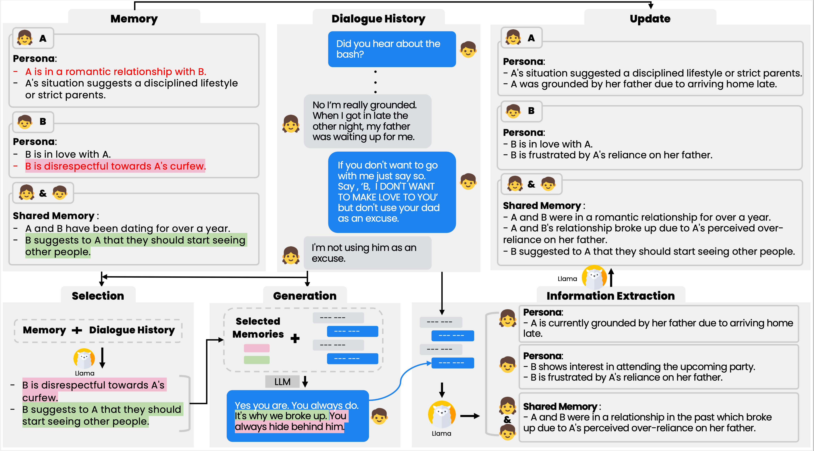
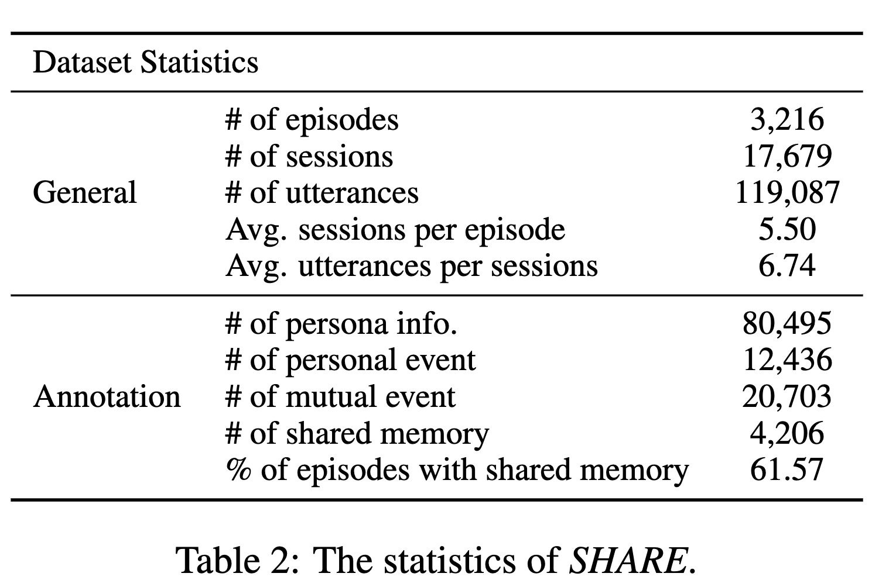

### This is the official project of paper: [SHARE: Shared Memory-Aware Open-Domain Long-Term Dialogue Dataset Constructed from Movie Script](https://arxiv.org/pdf/2410.20682)

# Overview


**SHARE** is a novel long-term dialogue dataset constructed from movie scripts, designed to enhance conversations by leveraging shared memories between individuals. It includes persona information, event summaries, and both explicit and implicit shared memories to enrich dialogue engagement. Additionally, we propose **EPISODE**, a dialogue framework that utilizes these shared experiences to make long-term conversations more engaging and sustainable.


## Datasets



## Download

Below are the Hugging Face model links used in this project. You can easily access and download them by clicking on the model names.

### 1. **Selection Model**
- [Selection Model](https://huggingface.co/eunwoneunwon/EPISODE-selection_llama3)

### 2. **Generation Models**
- [Generation Llama Model](https://huggingface.co/chano12/llama3_with_tag)
- [Generation Gemma Model](https://huggingface.co/chano12/gemma_with_tag)

### 3. **Extraction Model**
- [Extraction Model](https://huggingface.co/eunwoneunwon/EPISODE-extraction_llama3)

### 4. **Update Model**
- [Update Model](https://huggingface.co/chano12/update_llama)


## Training Code Reference

The implementation of the generation, selection, extraction, and update models in this project is inspired by the following repository:

- [Compress to Impress: Unleashing the Potential of Compressive Memory in Real-World Long-Term Conversations](https://github.com/nuochenpku/COMEDY.git)

Special thanks to the authors for providing an excellent foundation for our work.


# Installation
Clone this repository and install the required packages:
```bash
conda env create -f environment.yml
conda activate share
```
## Evaluation

### Automatic Evaluation
This section describes the code for creating an evaluation dataset.

1. Run `automatic_eval.sh` inside the `update_task` folder.
2. The entire system's modules will execute, generating the final response.

For more details about automatic evaluation, refer to the `eval/automatic_evaluation` folder.

---

### Multi-Session Evaluation
This section explains the code for multi-session evaluation.

1. Run `multi_session_eval.sh` inside the `update_task` folder.
2. Then, execute `multi_eval.sh` in the `evaluation/eval` folder to perform GPT evaluation.

**Note:** When running GPT evaluation, make sure to set the `OPENAI_API_KEY` environment variable.

---

### EPISODE Evaluation
This section provides instructions for EPISODE evaluation.

1. Run `multi_session_eval.sh` inside the `update_task` folder.
2. Then, execute `episode_share.sh` in the `evaluation/eval` folder to perform GPT evaluation.
**Note:** When running GPT evaluation, make sure to set the `OPENAI_API_KEY` environment variable.

# Citation

If you use this project in your research, please cite it as follows:

